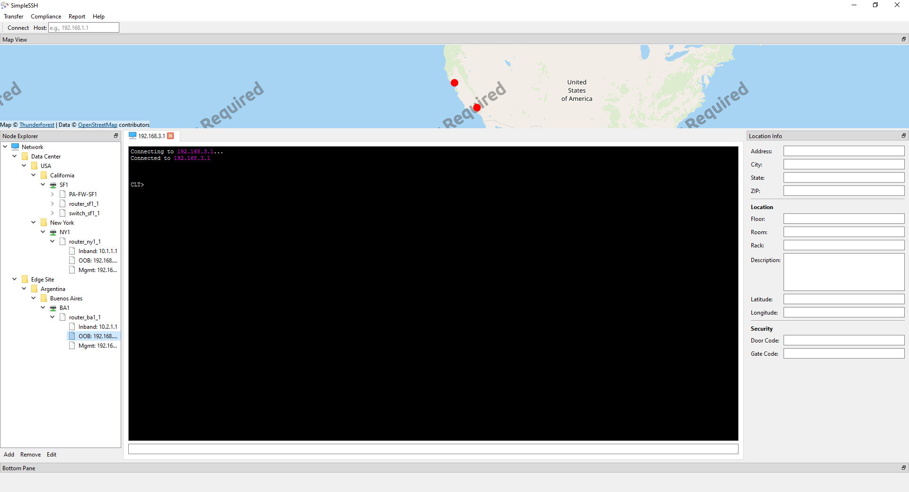

# SimpleSSH

**SimpleSSH** is a lightweight SSH client built to address real-world problems network engineers face in daily operations.

It focuses on fast access, session visibility, and practical workflows rather than feature bloat. The goal is to make connecting to devices, managing multiple sessions, and troubleshooting networks simpler and more reliable than traditional tools.

SimpleSSH is designed by a network engineer, for network engineers.

👉 **[Download SimpleSSH for Windows](https://github.com/ddh0429/SimpleSSH/releases/download/alpha/installer.exe)**

